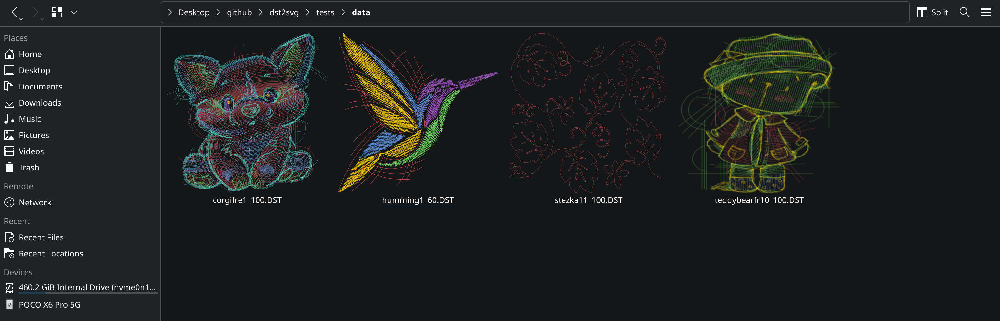

# dst2svg

A small, dependency-free command-line tool to convert Tajima DST embroidery files to SVG for previewing and thumbnail generation.

This project was created primarily to enable file-manager thumbnail previews (Nautilus, Dolphin, etc.) for .dst files by converting them to SVG, which can then be rasterized to PNG with standard tools.

## Prerequisites

- CMake and a C++ compiler.
- For thumbnailing: `librsvg2-bin` (provides `rsvg-convert`) or any SVG -> PNG tool.

On Debian/Ubuntu:

```bash
sudo apt update
sudo apt install cmake build-essential librsvg2-bin
```

## Build

```bash
git clone https://github.com/Nagasai561/dst2svg.git
cd dst2svg
cmake -S . -B build
cmake --build build --config Release
# Install locally
cp ./build/dst2svg ~/.local/bin/
```

Ensure `~/.local/bin` is in your `PATH` if you copy the binary there. Now you can use the tool as

```bash
dst2svg input_file.dst output_file.svg
```

## Integrating with File Manager Thumbnails

We will generate an SVG with `dst2svg` and then rasterize it to PNG for thumbnail display.

Example thumbnailer script `dst_thumbnailer.sh` (save to `~/.local/bin/dst_thumbnailer.sh` and make executable):

```bash
#!/bin/bash
# $1 = input file path (%i)
# $2 = output PNG path (%o)
# $3 = requested thumbnail size (%s)

INPUT_FILE="$1"
OUTPUT_PNG="$2"
SIZE="$3"

TEMP_SVG=$(mktemp --suffix=.svg)
dst2svg "$INPUT_FILE" "$TEMP_SVG"
rsvg-convert -w "$SIZE" -h "$SIZE" "$TEMP_SVG" -o "$OUTPUT_PNG"
rm -f "$TEMP_SVG"
```

Make the script executable:

```bash
chmod +x ~/.local/bin/dst_thumbnailer.sh
```

### Register MIME type

Create a file `~/.local/share/mime/packages/application-x-dst.xml` with:

```xml
<?xml version="1.0" encoding="UTF-8"?>
<mime-info xmlns="http://www.freedesktop.org/standards/shared-mime-info">
  <mime-type type="application/x-dst">
    <comment>DST (Data Stitch Tajima) embroidery file</comment>
    <glob pattern="*.dst"/>
  </mime-type>
</mime-info>
```

Then update the local mime database:

```bash
update-mime-database ~/.local/share/mime
```

### Thumbnailer desktop entry

Create `~/.local/share/thumbnailers/dst.thumbnailer` with:

```
[Thumbnailer Entry]
TryExec=/home/youruser/.local/bin/dst_thumbnailer.sh
Exec=/home/youruser/.local/bin/dst_thumbnailer.sh %i %o %s
MimeType=application/x-dst;
```

Replace `youruser` with your home directory username. After installing the thumbnailer, clear the thumbnail cache to force regeneration:

```bash
rm -rf ~/.cache/thumbnails/*
```

You should now see thumbnails for `.dst` files in your file manager.

## Example

Several sample `.dst` files are included under the `tests/data/` directory for quick experimentation.

Below picture shows how the result looks in dolphin. 



## Credits

- DST format reference: https://edutechwiki.unige.ch/en/Embroidery_format_DST
- Sample DST files used for demonstration were sourced from  https://embroideres.com/free-embroidery-designs/
